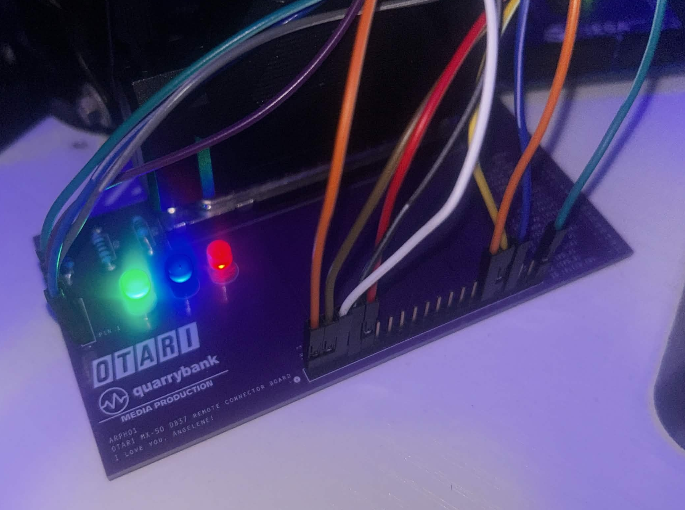

# otari_remote
A software-driven remote control system for the **Otari MX-50** professional 2-track reel-to-reel tape machine, built around an Arduino Mega 2560 and a custom interface board (ARPH01).
Designed and built by <a href="https://cameronos.github.io/quarrybank/#home">Quarrybank Media Production</a>.

### Languages and tools used
<p>
  <a href="https://www.java.com/"></a>
  &nbsp;
  <a href="https://www.arduino.cc/"></a>
  &nbsp;
  <a href="https://www.kicad.org/"></a>
</p>

---
## Overview
The Otari MX-50 exposes a **37-pin D-Sub parallel I/O connector** carrying transport control lines, tach pulse output, tally outputs, and tape direction signal. A male DB37 cable connects to this port via the ARPH01 interface board and an Arduino Mega, enabling full software control of the transport from a PC.

Features a **Windows 95-stylized Java GUI**, intended for cross-compatibility on Windows, Mac, and Linux.

---

## Screenshots


---

## Features

- Full transport control — Play, Stop, Rewind, Fast Forward, Record
- Tape position tracking via tach pulse counting (120 pulses/second at 15 ips)
- **Inertia-aware GOTO seek** — seeks to any `mm:ss` position automatically with coast compensation and recorrection
- Set tape position reference from machine counter (`t:<mm:ss>`)
- Return to zero (`z`)
- RGB LED status indicators on ARPH01 board
- Non-blocking transport pulse engine — respects 100ms minimum pulse spec
- Lightweight Java Swing GUI with developer serial console
- Cross-platform — runs on Windows, Linux, macOS

---

## Hardware
### ARPH01 — Arduino Remote Pin Header 01

The ARPH01 is a custom PCB that safely breaks out the Otari MX-50 DB37 remote connector to standard 2.54mm pin headers for the Arduino Mega.

**Key design decisions:**
- Power pins 33, 34, 35 (5V regulated and 24–40V unregulated) are **completely unconnected** and only connect to DB37 male connector. No trace to run out from. Prevents the voltage spike failure mode that motivated this project.
- Signal ground (pin 16) is kept separate from Arduino ground: two isolated ground domains.
- Three status LEDs (Red, Green, Blue) driven by Arduino PWM pins with 330Ω current limiting resistors.
- DB37 shield pins left unconnected.
- Manufactured by JLCPCB.

**Pin mapping (DB37 → J2 header):**
| DB37 Pin | Signal | J2 Pin |
|---|---|---|
| 1 | RECORD switch | 1 |
| 2 | PLAY switch | 2 |
| 3 | STOP switch | 3 |
| 4 | FFWD switch | 4 |
| 5 | REWIND switch | 5 |
| 6 | LIFTER switch | 6 |
| 9 | Safety shutoff | 7 |
| 10 | Record tally | 8 |
| 11 | Play tally | 9 |
| 12 | Stop tally | 10 |
| 13 | FFWD tally | 11 |
| 14 | Rewind tally | 12 |
| 16 | Signal ground | 13 |
| 17 | Tach pulse | 14 |
| 18 | Tape direction | 15 |
| 20 | Capstan speed clock | 16 |
| 21 | Tape speed A | 17 |
| 22 | Tape speed B | 18 |
| 23 | Pitch control enable | 19 |

**J3 (LED header):**

| Pin | Signal |
|---|---|
| 1 | LED Red (PWM) |
| 2 | LED Green (PWM) |
| 3 | LED Blue (PWM) |
| 4 | Arduino GND |

---

## Arduino Sketch
The sketch runs on an **Arduino Mega 2560** and communicates via USB serial at 9600 baud.

### Pin assignments
```cpp
#define PLAY_PIN      7
#define STOP_PIN      3
#define REWIND_PIN    5
#define FFWD_PIN      4
#define RECORD_PIN    6
#define TACH_PIN      18   // hardware interrupt
#define DIRECTION_PIN 19
#define LED_R         8
#define LED_G         10
#define LED_B         9
```

### Serial commands
| Command | Action |
|---|---|
| `p` | Play |
| `s` | Stop |
| `r` | Rewind |
| `f` | Fast forward |
| `rec` | Record (play + record) |
| `z` | Zero counter |
| `time` | Print current tape position |
| `t:<mm:ss>` | Set position reference e.g. `t:08:30` |
| `goto:<mm:ss>` | Seek to position e.g. `goto:08:30` |
| `debug` | Toggle debug tach output |

### Serial responses
```
ACK:PLAY
ACK:STOP
ACK:REWIND
ACK:FFWD
ACK:RECORD
ACK:ZERO
ACK:SETTIME
ACK:GOTO
ACK:ARRIVED_ON_TARGET
ACK:SEEK_ABORTED
Tape position:mm:ss
TACH:<pulses> INT:<interval> SPD:<speed> DIR:<0/1>
LED:<state>
```

### LED states
| State | Color | Pattern |
|---|---|---|
| Idle | All | Slow breathe |
| Play | Green | Solid |
| Stop | Red | Slow pulse |
| Fast forward | Blue/Red | Fast flicker |
| Rewind | Blue/Red | Slow flicker |
| Seeking | Blue | Pulse |
| Record | Yellow | Solid |

## Java GUI
The GUI is a single-file Java Swing application styled to look like a genuine 1990s Otari remote control program.

### Requirements
- Java 11 or later
- [jSerialComm](https://fazecast.github.io/jSerialComm/) library

### Building and running
```bash
# Download jSerialComm jar and place alongside OtariRemote.java
javac -cp jSerialComm-2.10.4.jar OtariRemote.java
java -cp .:jSerialComm-2.10.4.jar OtariRemote
```

On Windows:
```bash
javac -cp jSerialComm-2.10.4.jar OtariRemote.java
java -cp .;jSerialComm-2.10.4.jar OtariRemote
```

Place any .png images in the same directory as the compiled class.

### GUI features
- Port selection dialog on launch
- Dark mode dialog on launch
- Transport buttons with drawn icons to resemble machine layout and design.
- Live tape position display updated from Arduino serial stream with tallies.
- GOTO field — type `mm:ss` and press GO
- Status panel — transport state, speed, cue, remote enable
- Developer console — colour-coded serial monitor (TX blue, RX green, ACK yellow)
- File menu — connect/disconnect serial, exit
- Transport menu — keyboard-accessible transport commands
- Options menu — tape speed selection, toggle dev console
- Help → About — displays logo, version, credits

---

## Important Safety Note
The Otari MX-50 DB37 remote connector carries **24–40V unregulated power** on pins 34 and 35, slightly adjacent to 5V logic lines. Exposing these pins with bare jumper wires can destroy logic chips on the control board instantly. *I learned the hard way.*
**Always use the ARPH01 board or equivalent protection.** The ARPH01 leaves all power pins completely unconnected — no trace, no path for voltage to reach the Arduino.
This note exists because the machine's logic control board was destroyed once already during development. Nine logic chips were lost to a single moment of contact, including the propietary Otari IC-0112 chip.

---

## Project background
This project started as a simple Arduino remote control for a tape machine. It became a months-long board-level fault diagnosis after a voltage spike destroyed nine chips including the main CPU, EPROM, SRAM, and multiple bus decoders. The machine was eventually repaired using a donor control board.
